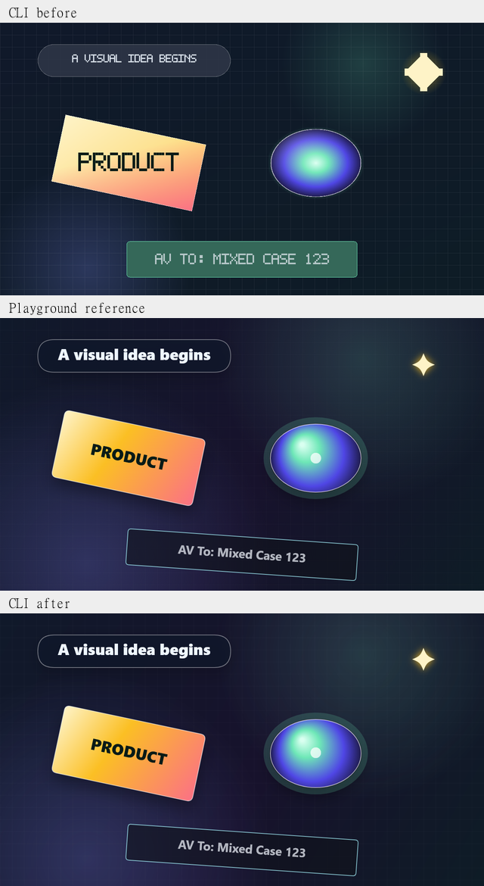
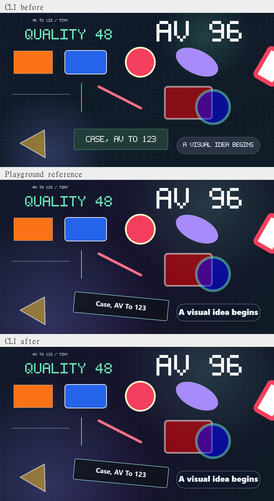
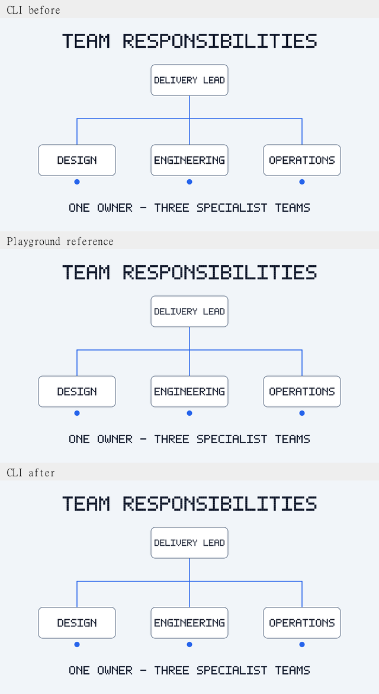

# CLI visual rendering parity

The CLI now paints the existing temporal scenes with a CPU Skia rasterizer.
The source language, AST, timeline, `StateAt(t)`, shared shape geometry, audio,
frame scheduling, parallelism, FFmpeg arguments and Playground UI are unchanged.

## Investigation: where the paths diverged

Both adapters consume `TemporalVisualSceneBuilder.Build(StateAt(t))` in the
same logical 1280×720 coordinate space. Explicit shapes already arrive as
ordered, transformed `TemporalShapePath` objects. The Playground paints them
in `wwwroot/js/visual-scene-renderer.js`; the CLI previously used hand-written
pixel loops in `TemporalVideoFrameRenderer`.

| Area | Previous CLI difference | Current rendering |
|---|---|---|
| Background | Two-stop interpolation; missing purple midpoint; normalized diagonal differed from Canvas projection | Three-stop linear gradient at 0/.55/1, identical endpoints |
| Glows/grid | Glow radii used minimum dimension; grid was stronger with different spacing at small sizes | Maximum-dimension radial gradients and matching grid spacing, offset and alpha |
| Explicit text | Shared 5×7 glyph paths, but binary point-in-polygon coverage made edges jagged | Same uppercase glyph geometry with antialiased path coverage |
| Legacy labels | All-uppercase bitmap glyphs, approximate sizing/centering, no kerning | Shaped UI-font glyphs, mixed case, weight, advance measurement, subpixel placement and Canvas middle baseline |
| Explicit shapes | Binary fill coverage, approximate stroke-distance antialiasing | Winding fills and antialiased centered strokes; round caps and joins |
| Legacy cards | Approximate colors, corners, borders and missing shadows | Matching quadratic corners, gradient stops, logical two-pixel borders and shadows |
| Legacy circle/sparkle | Approximate orb gradient; different sparkle; missing circle label | Two-point conical gradient, ellipse/halo, shaped symbols and glow |
| Rotation | Only product body partially rotated; labels and other legacy kinds did not | Rotate the entire legacy primitive around its shared center |
| Alpha/layers | Hand-rounded pixel blending | sRGB, premultiplied source-over; opacity applied separately to each fill/stroke, in source order |
| Coordinates/clipping | Pixel rounding in individual painting functions | Floating-point paths until rasterization, one viewport scale, native canvas clipping |

No second visual-property interpreter was added. Explicit geometry, text size,
uppercase conversion, layout, animation values and source order continue to
come from the existing shared scene builder. Legacy decorations follow the
existing browser paint profile. Browser-reference tests record the renderer
source hash so later browser changes require a deliberate parity review.

## Text decisions

Explicit `shape text` is intentionally a portable uppercase bitmap font in
the Playground today. Replacing it with a new font only in CLI would reduce
parity. Its shared paths remain intact; their edges receive mature coverage
antialiasing at large, small, fractional and rotated placements.

Legacy labels (`intro`, `product`, `circle`, `sparkle`, generic cards) now use
SkiaSharp/HarfBuzz. Font weights and font-size clamps match the browser's
existing formulas. Horizontal fitting uses shaped advances and Canvas's
`width - 18` maximum width, retaining the font height. The middle baseline uses
half the x-height; centering with ascent/descent had caused a visible vertical
offset. Labels remain single-line, as in Canvas, with no new wrapping policy.

Windows uses installed Segoe UI. macOS prefers its UI face/Helvetica Neue and
Linux prefers DejaVu Sans/Noto Sans. Noto Sans Regular/Bold are embedded as
SIL Open Font License fallbacks for machines without suitable installed fonts;
their license is copied into published output. No proprietary fonts are bundled.

## Captures and pixel measurements

Captured on Windows, Intel Core i3-1125G4 (4 cores/8 threads), .NET 8,
Chromium/Edge. Exact browser version and renderer hash are recorded in
[reference metadata](assets/visual-parity/reference.metadata.json).
Comparisons use native 1280×720 frames (plus 640×360 coverage), device pixel
ratio 1 and matching timestamps. No resolution increase or codec changes were
used to improve the scores. Pixel measurements are made before lossy encoding.

The actual compiled Playground was also driven through its source editor,
Evaluate timeline button and time input. All nine native-size scenes matched
the standalone browser reference pixels exactly. WASM/native trigonometry can
vary below 1e-9 logical pixels, so the scene comparison tolerates that rounding.

MAE is mean absolute RGB channel error on a 0–255 scale. The last columns count
pixels with any channel differing by more than 16. Lower is closer.

| Scene/time, 1280×720 | MAE before | MAE after | Pixels >16 before | Pixels >16 after |
|---|---:|---:|---:|---:|
| Legacy cards, 1s | 16.766 | 0.984 | 30.228% | 0.715% |
| Primitives, 0s | 9.844 | 0.658 | 22.696% | 0.385% |
| Primitives, 1s | 10.071 | 0.794 | 22.635% | 0.528% |
| Primitives, 2s | 10.076 | 0.794 | 22.502% | 0.592% |
| Org chart, 4.5s | 0.671 | 0.064 | 1.152% | 0.145% |
| Information cards, 4s | 0.847 | 0.087 | 1.390% | 0.218% |
| visual-temporal, 0s | 8.643 | 0.658 | 19.253% | 0.201% |
| visual-temporal, 3s | 6.450 | 0.391 | 15.841% | 0.015% |
| visual-temporal, 8s | 7.480 | 0.433 | 17.100% | 0.007% |

The sheets below show CLI before, Playground reference and CLI after. They are
scaled for viewing only; measurements and regression references use full-size
images. The local `obj/visual-parity/comparison.html` gallery contains all
native frames and the directory also contains amplified difference images.







Full results: [before metrics](assets/visual-parity/before.metrics.json),
[after metrics](assets/visual-parity/after.metrics.json).

## Performance and export

The repeatable harness warms each case once, then times a second render and
checks byte equality. Representative Debug per-frame times on this machine:

| Frame | Before | After |
|---|---:|---:|
| Legacy cards, 1280×720 | 134.22 ms | 56.07 ms |
| Primitives at 1s, 1280×720 | 842.41 ms | 40.10 ms |
| Org chart at 4.5s, 1280×720 | 528.23 ms | 37.54 ms |
| Information cards at 4s, 1280×720 | 761.66 ms | 39.41 ms |

These are single warm observations, not statistical benchmarks or guarantees.
They show that the quality improvement did not require slower rasterization in
these cases. Timings include PPM byte construction, exclude disk I/O/encoding,
and do not measure peak memory. Skia adds native dependencies and RGBA buffers;
the existing bounded worker count and PPM file pipeline remain unchanged.

Raw data: [before timings](assets/visual-parity/before.timings.json),
[after timings](assets/visual-parity/after.timings.json).

A self-contained Windows single-file CLI was published and used to export the
legacy fixture at 640×360/30 FPS with four workers. FFmpeg decode verification
passed: 90 VP9 frames, Opus audio, 3.008s container duration for the 3s scene
(codec timing overhead). Its reported frame stage was 781ms and total command
time 2.83s. The font license is present in the publish directory. A self-contained
Linux x64 single-file cross-publish also succeeded. macOS/Linux execution is
left to the existing multi-OS CI; Linux's Skia build requires fontconfig.

## Regression coverage and reproduction

The final Windows Debug suite passed **985 tests, with zero failures and zero
skips**, including all 975 existing tests and 10 new parity cases. All 12 frame
comparisons passed their thresholds, and all nine native-size references were
verified against the live Playground.

`VisualParityTests` adds browser PNG references with tolerances, a renderer
revision guard, source-over/layer-order checks at three aspect ratios,
transparency/state preservation, mixed-case labels and concurrent deterministic
raster checks. Diagram references are font independent and use tighter
thresholds than references containing platform UI fonts. No unit test asserts
wall-clock performance. Existing audio, synchronization, geometry and export
tests are retained.

```sh
dotnet test src/SoundScript.Tests -c Debug
dotnet run --project tools/VisualParity -- obj/visual-parity after
# Install playwright and sharp in your development environment, or set NODE_PATH.
# Set CHROMIUM_CHANNEL=chrome when Edge is unavailable, or CHROMIUM_PATH.
node scripts/verify-visual-parity.cjs obj/visual-parity after --assert
dotnet run --project src/SoundScript.Playground --no-launch-profile --urls http://127.0.0.1:5194
# In another terminal:
node scripts/verify-visual-parity-playground.cjs http://127.0.0.1:5194/
```

The before captures use the rasterizer at `cd0def3`, with the same harness and
fixtures. Copy those harness files into a separate checkout at that revision,
run it with the `before` label, then compare the generated PPMs with the same
browser renderer. Do not regenerate browser goldens from CLI output.

## Remaining differences

UI-font selection, hinting, fallback glyphs and rasterizer versions differ by
platform. Gradient quantization, shadow blur and edge coverage can differ
slightly between software Skia and browser GPU rendering. Exact CLI frame
bytes are deterministic within the same font/library/platform environment;
cross-platform UI-font byte identity is not promised. Explicit text preserves
the Playground's intentionally block-shaped glyphs. Switching both platforms
to a new typography design would be a separate task.

WebM introduces the same existing VP9/Opus compression and timing behavior.
Container bytes may vary due to FFmpeg metadata; parity is assessed on the
uncompressed scene frames, not container hashes.
